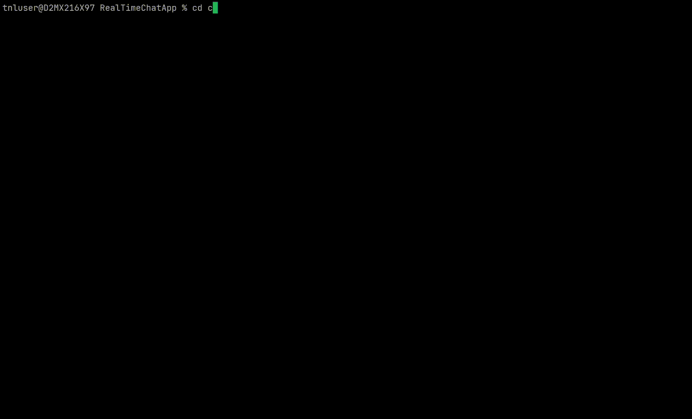

# RealTimeChatApp

## Setup

Clone the project:

```bash
git clone https://github.com/r11234/RealTimeChatApp.git
cd RealTimeChatApp # change directory to the cloned project
```

Start the frontend:

```bash
cd client
npm run build
npm run preview 
```

Start the backend:

```bash
cd server
cargo run --bin server -r
```

## Demo

